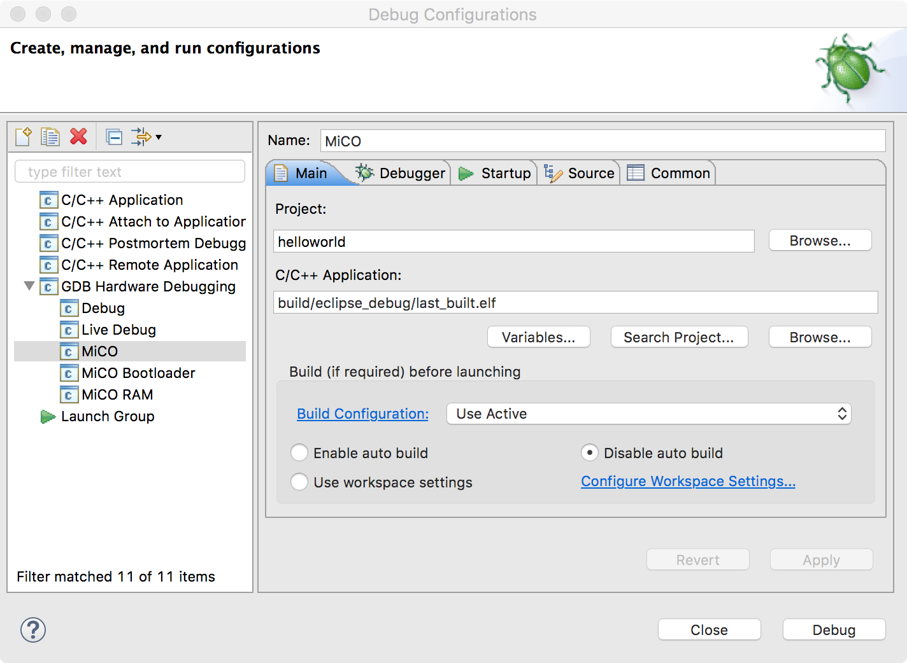
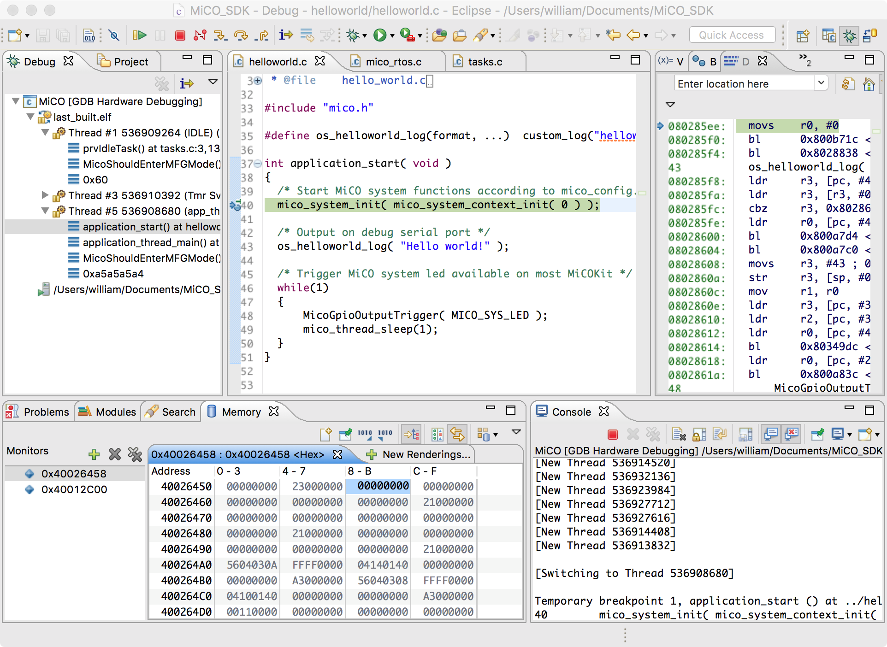

# Getting started with Helloworld app on MiCO OS

This guide reviews the steps required to get `helloworld` app working on an MiCO OS platform.

Please install [mico CLI](https://code.aliyun.com/mico/mico-cli).

## Import the example application

From the command-line, import the example:

```
mico import helloworld
cd helloworld
```

### Now compile

Invoke `mico make`, and specify the name of your platform and application. For example, MiCOKit-3165 dev board:

```
mico make helloworld@MK3165
```

Your PC may take a few minutes to compile your code. At the end, you see the following result:

```
[snip]
                        MICO MEMORY MAP                            
|=================================================================|
| MODULE                                   | ROM       | RAM      |
|=================================================================|
| App_Helloworld                           | 141       | 0        |
| Board_MK3165                             | 1308      | 124      |
| crt0_GCC                                 | 272       | 0        |
| FreeRTOS                                 | 5832      | 424      |
| hardfault_handler                        | 991       | 0        |
| libc                                     | 38059     | 2268     |
| libgcc                                   | 3360      | 0        |
[snip]
| STM32F4xx                                | 5115      | 2215     |
| STM32F4xx_Peripheral_Drivers             | 9299      | 236      |
| STM32F4xx_Peripheral_Libraries           | 5948      | 16       |
| *fill*                                   | 253       | 926      |
|=================================================================|
| TOTAL (bytes)                            | 243524    | 34971    |
|=================================================================|
Build complete
Making .gdbinit
Making .openocd_cfg
```

### Program your board

1. Connect your MiCO device to the computer over USB.
1. Connect your MiCO device's JTAG port to the computer over JTAG debugger (Jlink, stlink, CMSIS-DAP etc.)
1. From the command-line, run the following command:

```
mico make MK3165 download run JTAG=jlink_swd
```
After `helloworld` app is downloaded and run, the LED on your platform turns on and off.

<span class="tips">**Note:** If you download app first time, use command option `total` to download all neccessory images. For example `mico make MK3165 total download run JTAG=jlink_swd`  。</span>


## Program, Compile and Debug your application using MiCoder IDE
Use **MiCoder IDE** to import `helloworld` app and debug:

1. Start MiCoder IDE.
1. Import `helloworld` application to MiCoder IDE. (From the File > Import, select General > Existing Projects into Workspace)
1. Change current debug project to `helloworld` (From the Debug Configurations > GDB Hardware Debugging > MiCO, change Project to `helloworld` ), and apply
1. Set breakpoints, and start a debug session.




## Troubleshooting

1. Make sure `mico-cli` is working correctly and its version is `>1.0.0`

 ```
 mico --version
 ```

 If not, you can update it:

 ```
 pip install mico-cli --upgrade
 ```